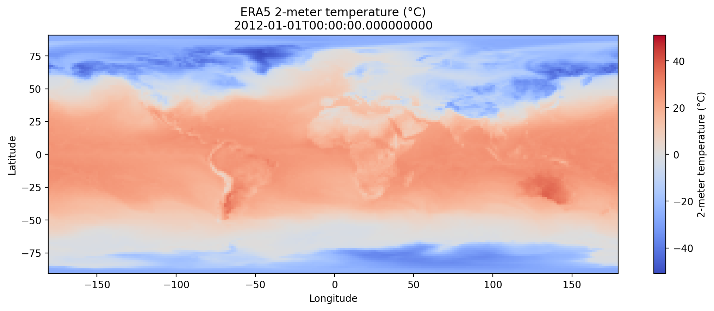
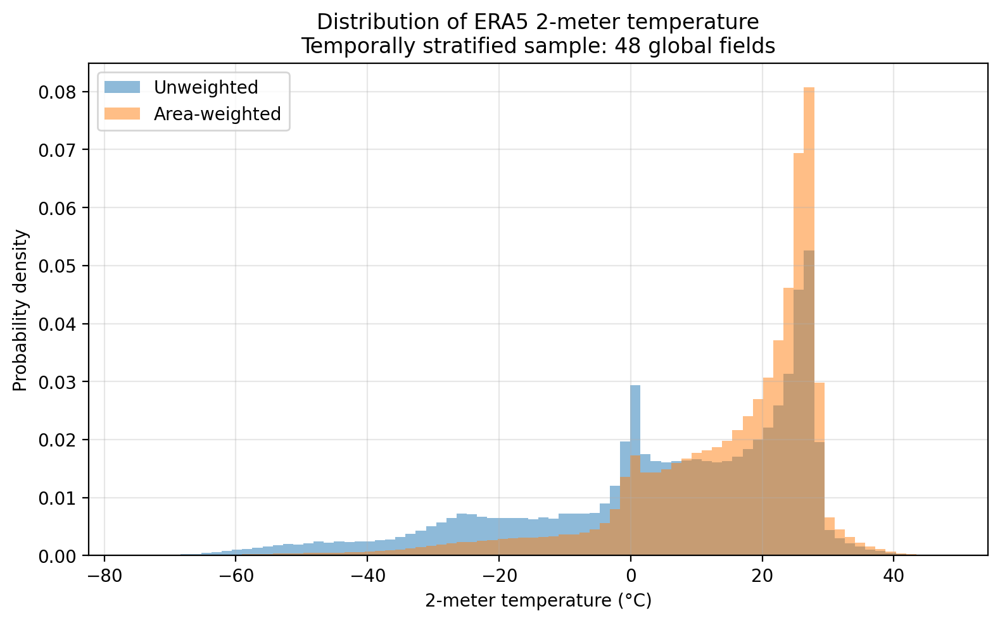
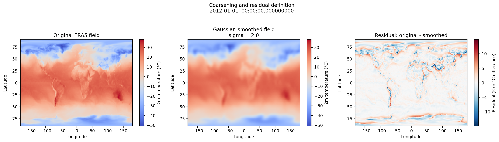
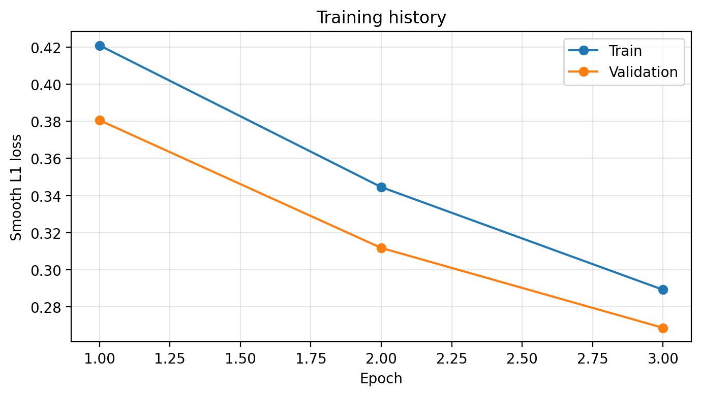
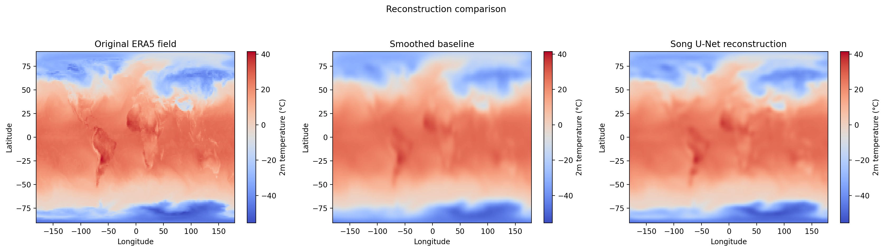
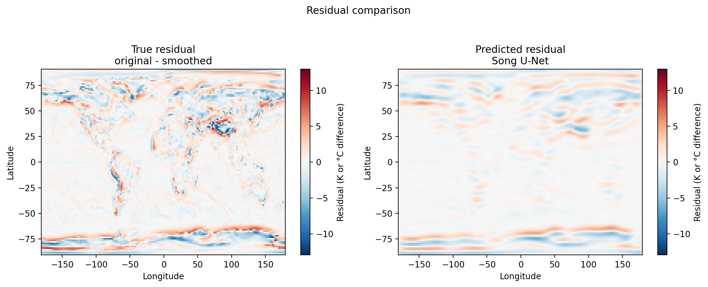
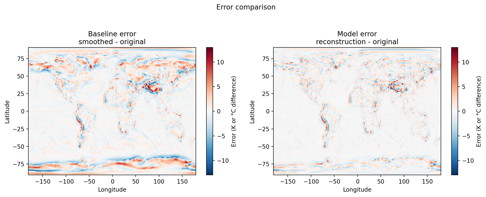

# Residual-Based Climate Downscaling with Song U-Net

A reproducible deep-learning workflow for reconstructing spatial detail in global climate fields using **residual learning** and a **Song U-Net** architecture.

This project explores a simplified climate-downscaling inverse problem using **ERA5 2-meter temperature fields**. A controlled spatial degradation is introduced through Gaussian smoothing, and a neural network is trained to reconstruct the spatial information removed by that degradation.

The project combines:

- geospatial climate data processing with **xarray**
- spatial filtering and inverse-problem formulation
- residual learning
- convolutional encoder-decoder architectures
- **Song U-Net** from IPSL-AID
- PyTorch model training and evaluation
- physically interpretable diagnostics in temperature units
- reproducible scientific visualization and reporting

> The objective is not to present an operational climate downscaling product, but to demonstrate a transparent and reproducible workflow connecting geophysical data, spatial degradation, deep learning, reconstruction, and quantitative evaluation.

---

## 1. Climate data

The experiment uses **ERA5 2-meter air temperature** fields distributed through WeatherBench2.

Each observation is represented as a global georeferenced latitude-longitude field:

```text
1 × 121 × 240
```

where the single channel corresponds to near-surface temperature.

The workflow uses temporally separated periods for training, validation, and testing.

### Example ERA5 temperature field



ERA5 is a reanalysis product combining heterogeneous observations with numerical weather prediction through data assimilation. It provides spatially and temporally complete atmospheric fields and is therefore particularly useful for developing and evaluating spatial reconstruction methods.

---

## 2. Statistical characterization of the global field

Because a regular latitude-longitude grid does not represent equal physical surface areas at every latitude, descriptive statistics can be calculated both directly and using latitude-dependent area weighting.



This step illustrates an important aspect of global geospatial modelling: statistical treatment should account for the geometry of the Earth grid rather than treating every grid cell as representing the same physical area.

---

## 3. Formulating downscaling as an inverse problem

A controlled degradation operator is applied to the original ERA5 temperature field using a spatial Gaussian filter.

Let

[
y_{\mathrm{HR}}
]

denote the original ERA5 field and

[
y_{\mathrm{smooth}}
]

the spatially smoothed field.

The information removed by the degradation operation is represented by the residual:

[
R = y_{\mathrm{HR}} - y_{\mathrm{smooth}}.
]

The reconstruction problem can therefore be written as

[
\hat{y}_{\mathrm{HR}}
=
y_{\mathrm{smooth}} + \hat{R}.
]

Instead of asking the neural network to reconstruct the complete temperature field from scratch, the model only needs to estimate the missing spatial correction.

### Controlled degradation and residual definition



The Gaussian operator preserves the broad spatial structure of the climate field while attenuating finer-scale variability.

Importantly, this experiment does **not** change the number of grid cells. The original, degraded, and residual fields remain defined on the same georeferenced grid. The experiment therefore represents degradation of effective spatial information rather than geometrical regridding.

---

## 4. Residual-learning strategy

The learning problem is

[
T_{\mathrm{smooth}}
\longrightarrow
\hat{R},
]

where the neural network estimates the residual removed by spatial smoothing.

The reconstructed field is then

[
\hat{T}_{\mathrm{HR}}
=
T_{\mathrm{smooth}}+\hat{R}.
]

This formulation separates two components:

**Large-scale climate structure**

Already contained in the smoothed field.

**Fine-scale spatial correction**

Estimated by the neural network.

This makes the learning problem both computationally simpler and scientifically interpretable.

---

## 5. Song U-Net architecture

The neural architecture is based on the `SongUNet` implementation available in **IPSL-AID**.

In this experiment it is used as a **deterministic image-to-image regression network**, rather than as a diffusion model.

The input is the normalized smoothed temperature field:

[
x_{\mathrm{norm}}
]

and the network predicts the normalized residual:

[
\hat{R}_{\mathrm{norm}}
=
G_\theta(x_{\mathrm{norm}}).
]

A U-Net is particularly suitable for this task because it combines:

- multi-scale spatial representation
- encoder-decoder processing
- local and large-scale contextual information
- skip connections preserving spatial structure
- dense field reconstruction

### Handling the ERA5 grid

The ERA5 field used here has dimensions

```text
121 × 240
```

The odd latitude dimension can generate size incompatibilities during repeated U-Net downsampling and upsampling.

A lightweight wrapper therefore temporarily transforms the spatial dimensions:

```text
121 × 240
      ↓
128 × 240
      ↓
Song U-Net
      ↓
128 × 240
      ↓
121 × 240
```

Padding uses border-value replication and only the artificially introduced rows are removed after inference.

The final prediction therefore remains defined on the original ERA5 grid.

---

## 6. Training

The model is trained to minimize the error between the predicted and true normalized residual fields.

The current experiment uses `SmoothL1Loss`, providing a stable compromise between squared-error and absolute-error behaviour.

### Training history



The experiment deliberately uses a compact model and a small temporally stratified sample so that the complete workflow can be executed locally on CPU.

The emphasis is therefore on **methodological clarity and reproducibility**, rather than maximizing predictive performance.

---

## 7. Reconstruction

During inference, the predicted normalized residual is transformed back into physical temperature units:

[
\hat{R}
=
\hat{R}_{\mathrm{norm}}\sigma_R+\mu_R.
]

The final reconstructed temperature field is

[
\hat{y}_{\mathrm{HR}}
=
y_{\mathrm{smooth}}+\hat{R}.
]

The natural baseline is simply

[
y_{\mathrm{baseline}}
=
y_{\mathrm{smooth}},
]

which corresponds to assuming that no residual correction is necessary.

### Original field, degraded baseline and neural reconstruction



This comparison provides the central test of the workflow: whether the learned residual restores spatial information that was removed by the degradation operator.

---

## 8. What does the network actually learn?

The most informative diagnostic is not only the reconstructed temperature field, but the residual itself.

The true missing spatial information is

[
R
=
y_{\mathrm{HR}}-y_{\mathrm{smooth}},
]

while the network estimates

[
\hat{R}
=
G_\theta(y_{\mathrm{smooth}}).
]

### True versus predicted residual



Residual maps make the learning task directly interpretable: they show whether the neural network is recovering spatial structures removed by smoothing rather than merely reproducing the large-scale temperature field.

---

## 9. Reconstruction error

Error maps provide a spatial diagnostic of whether residual learning improves the degraded baseline.

### Baseline and Song U-Net reconstruction errors



Performance is evaluated in physical temperature units.

| Metric | Smoothed baseline | Song U-Net reconstruction | Improvement |
|---|---:|---:|---:|
| MAE | 1.2017 K | 0.8237 K | 31.45% |
| RMSE | 1.9253 K | 1.3618 K | 29.27% |
| Bias | -0.0040 K | -0.0441 K | — |

The learned residual therefore reduces both MAE and RMSE relative to using the spatially smoothed temperature field directly.

Because the experiment uses a small temporal sample and CPU-based training, these values should be interpreted as a **workflow validation**, not as an operational downscaling benchmark.

---

## 10. Why residual learning?

The degraded temperature field already contains much of the dominant climate signal:

- large-scale atmospheric structure
- equator-to-pole temperature gradients
- seasonal patterns
- broad land-ocean contrasts

Predicting the complete field from scratch would require the network to reproduce information already present in the input.

Residual learning instead asks a more focused question:

> **What spatial information is missing from the degraded field?**

The network therefore learns a correction rather than the complete climate state.

This formulation is particularly useful for inverse problems in which a physically meaningful baseline already contains most of the large-scale signal.

---

## 11. Deterministic reconstruction and generative extensions

The current implementation is deterministic:

[
T_{\mathrm{smooth}}
\rightarrow
\hat{R}.
]

For a given degraded field, the model produces one residual reconstruction.

A probabilistic or diffusion-based formulation would instead learn a distribution of plausible residual fields. During inference, such a model could start from noise and generate different fine-scale corrections conditioned on the coarse climate state:

[
(\mathrm{noise},y_{\mathrm{coarse}})
\rightarrow
\hat{R}.
]

This distinction becomes particularly relevant for variables such as **precipitation**, where fine-scale structure can be intermittent, strongly non-Gaussian, and intrinsically uncertain.

The deterministic Song U-Net implemented here therefore provides a reproducible foundation for future probabilistic and generative downscaling experiments.

---

## 12. Physical and spatial extensions

Pixel-wise reconstruction metrics alone are not sufficient to characterize geophysical fields.

Future extensions could incorporate:

- gradient-based losses
- Laplacian or edge-aware objectives
- spatial-frequency / spectral diagnostics
- residual spatial correlation
- latitude-area-weighted losses
- orography
- land-sea masks
- latitude and longitude
- pressure
- humidity
- wind
- precipitation
- multi-variable conditioning

Static topographic information is particularly interesting because terrain elevation can provide physically meaningful spatial context for reconstructing near-surface climate variables.

For operational experiments, evaluation should additionally be stratified by season, geographical region, surface type, and climate regime.

---

## 13. Project structure

```text
climate-residual-downscaling-unet/
│
├── notebooks/
│   └── residual_downscaling_demo.ipynb
│
├── src/
│   ├── __init__.py
│   ├── data.py
│   ├── preprocessing.py
│   ├── model.py
│   ├── train.py
│   ├── evaluate.py
│   └── visualization.py
│
├── tests/
│   └── test_shapes.py
│
├── results/
│   ├── figures/
│   ├── tables/
│   └── reports/
│
├── environment.yml
├── .gitignore
└── README.md
```

The notebook provides the complete experimental workflow, while the `src/` directory separates data handling, preprocessing, modelling, training, evaluation, and visualization into reusable components.

---

## 14. Reproducibility

The environment is defined in:

```bash
environment.yml
```

Create the environment with:

```bash
conda env create -f environment.yml
```

Activate it with:

```bash
conda activate ipsl-aid
```

The workflow uses:

- Python
- NumPy
- pandas
- xarray
- SciPy
- PyTorch
- Matplotlib
- IPSL-AID

Large climate datasets and model checkpoints are intentionally excluded from Git version control.

---

## 15. Scope

This repository should be interpreted as a **research and engineering demonstration of a residual climate-reconstruction workflow**.

It demonstrates how a gridded geophysical field can be:

1. loaded and statistically characterized,
2. spatially degraded under a controlled transformation,
3. formulated as an inverse problem,
4. represented through a residual target,
5. learned using a convolutional neural architecture,
6. reconstructed in physical units,
7. evaluated against a transparent baseline, and
8. analyzed through spatially explicit diagnostics.

The implementation provides a foundation for larger-scale climate downscaling experiments using GPU/HPC computing, multi-variable conditioning, more realistic coarse-resolution inputs, physically informed objectives, and probabilistic or generative reconstruction.

---

## Author

**Edgar Steven Correa Pinzón, PhD**

Research interests: artificial intelligence, mechanistic modelling, environmental systems, geospatial data, scientific computing, image analysis, and quantitative modelling.

